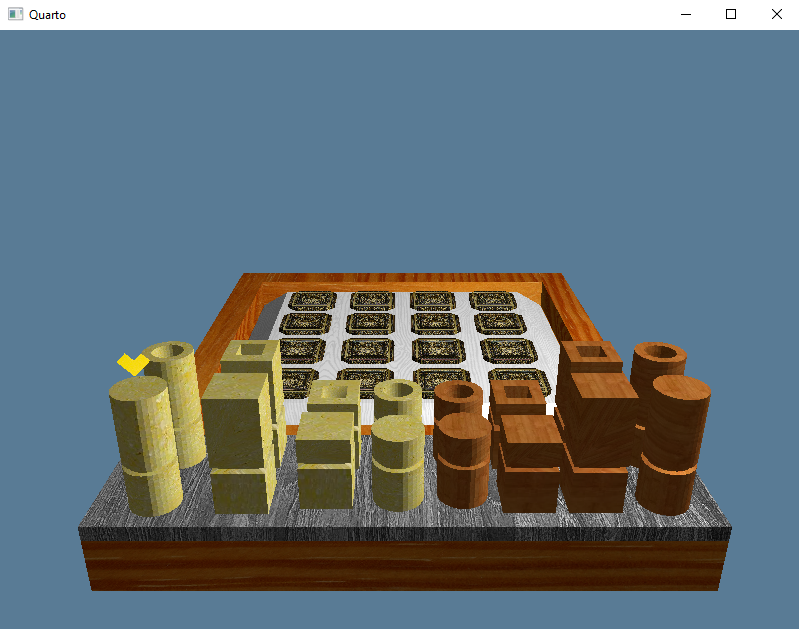
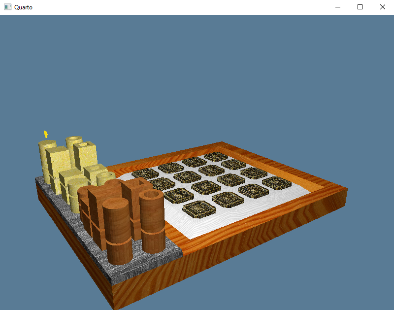

# quarto-wgpu-rust

A simple graphics project for Quarto board game, written with [rust](https://www.rust-lang.org/) programming language and [wgpu](https://github.com/gfx-rs/wgpu) graphics api (based on [WebGPU standard](https://gpuweb.github.io/gpuweb/)).

This project has been done following instructions from the wgpu tutorial: https://sotrh.github.io/learn-wgpu/

## Rendered View Samples

Front View | Side View 
-|-
 | 

To find the full lists of view samples, go to the [rendered view samples folder](https://github.com/NSadikhov/quarto-wgpu-rust/tree/main/assets/images/rendered_view_samples).

## Getting Started

Clone and run from source:
```
git clone https://github.com/NSadikhov/quarto-wgpu-rust.git
```
```
cargo run
```


